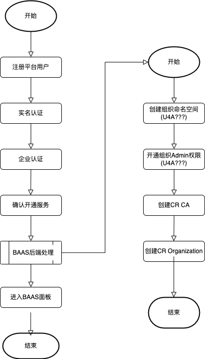

# BAAS服务开通

平台用户申请开通BAAS服务的流程



## 平台用户操作流程

### 用户注册

1. 用户通过平台注册引导完成用户注册

注册完成后获得:

```text
- UID: 用户唯一的账户ID
```

### 申请开通服务

1. 平台用户通过BAAS服务开通引导完成个人实名认证和企业认证。

其中，企业认证过程需提供:

- 企业名称，用作信息展示
- 企业唯一`ORGID`，用作BAAS服务中的企业MSPID
- 企业位置信息，用于企业对应CA的证书内容，如下:

```go
   Country:            []string{"US"},
   Province:           []string{"North Carolina"},
   Locality:           []string{"Durham"},
   Organization:       []string{"IBM"},
   OrganizationalUnit: []string{"Blockchain"},
   CommonName:         endpoints.API,
```

- 企业CA选项，仅支持`Fabric-CA`

2. 平台用户确认开通`BAAS`服务，等待服务初始化完成

3. 平台用户进入`BAAS`面板

## 平台处理流程

### 平台组织初始化

1. 为企业创建新的命名空间`{ORGID}-baas`

2. 为当前用户开通IAM`Admin`权限

3. 为用户生成随机密码 `Secret`

4. 以`UID:Secret`作为CA admin identity，部署`CR CA`：

5. 创建`CR Organization`

6. 创建完成后，跳转到`BAAS`面板
