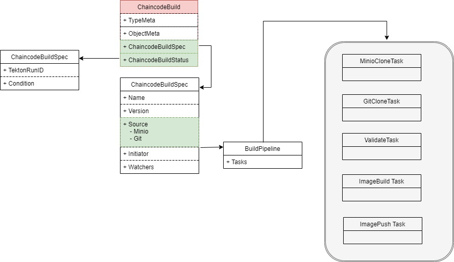
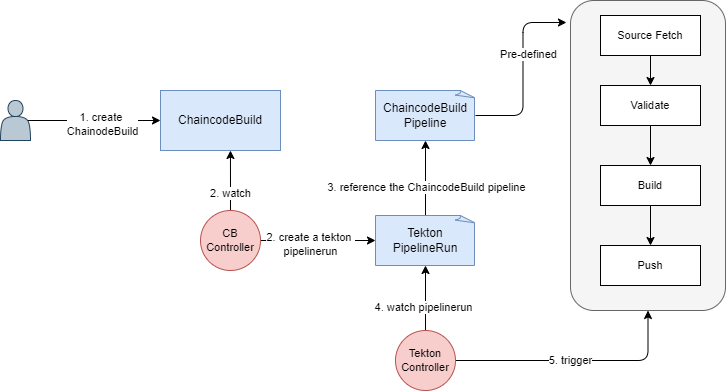

# Chaincode build with Tekton CI

`ChaincodeBuild`为`Cluster`级别的资源

## RBAC设计

1. 默认发起ChaincodeBuild的组织admin用户具备
    - `get`
    - `update/patch`
2. 其他非`initiator`用户，需要组织Admin用户通过更新`Watchers`，赋予
    - `get` : 合约代码分享给其他组织

3. 允许转移`initator`给其他用户

4. 当`Watchers`不为空时，不允许删除

5. Tekton CI位于Namepsace `tekton-ci`，所有用户默认不具备任何权限，获取权限途径:
    - `get`权限
        - ChaincodeBuild.spec.owners，则自动拥有该Build对应的Tekton CI的 `get` 权限


## CRD设计



```go
type ChaincodeBuildSpect struct {
    Name string    `json:"name"`
    Version string `json:"version"`

    // Source where stores Chaincode Code
    Source  `json:",inline"`

    Initiator Member `json:"initiator"`

    // Organizations who can watch this ChaincodeBuild
    Wachters []Member `json:"watchers,omitempty"`
}


type Source struct {
    // configmap/secret which stores minio info
    Minio `json:"minio"`
    // configmap/scret which stores git info
    Git `json:"git"`
}

// Use Minio to store chaincode code
type Minio struct {
    // TO BE DEFINED
}

// Use git to store chaincode code 
// TO BE DEFINED
type Git struct {
    URL string `json:"url"`
    revision string `json:"revision"`
}

// TO BE DEFINED
type ChaincodeBuildStatus struct {
    TektonRunId string
}
```


## Dev Design

整体基于Tekton CI实现，依赖组件：

 - Tekton CI
 - a docker private registry

### 预定义 ChaincodeBuildPipeline 

参考 `https://github.com/tektoncd/catalog/blob/main/pipeline/buildpacks/0.2/buildpacks.yaml`

- Task1: Source Fetch
    - Git Clone
    - Minio Get
- Task2: Valiate source code
- Task3: Build image
- Task4: Push image

### 镜像存储

1. 是否应具备默认的镜像仓库地址 `hub.docker.io` ???

2. 镜像名称定义

{Registry_URL}/{ChaincodeBuild.Namespace}/{ChaincodeBuild.Spec.Name}:{ChaincodeBuild.Spec.Version}

3. 镜像权限

- Public ？？？


### 核心流程




#### 创建ChaincodeBuild

#### 更新ChaincodeBuild

> Note: 
>   - 不允许修改`Name` \  `Version` \ `Source`
>   - 必须至少有一个Ower是initator

##### 更新Initiator

1. 将Initiator的权限转给新组织的admin用户

##### 更新watcher
1. 增加owner,授予其他组织访问权限

2. 删除owner，回收

3. 更新`initiator`，将ChaincodeBuild权限授予给其他人


#### 删除ChaincodeBuild

> NOTE: 当owners包含其他非`initiator`组织时，不允许删除

