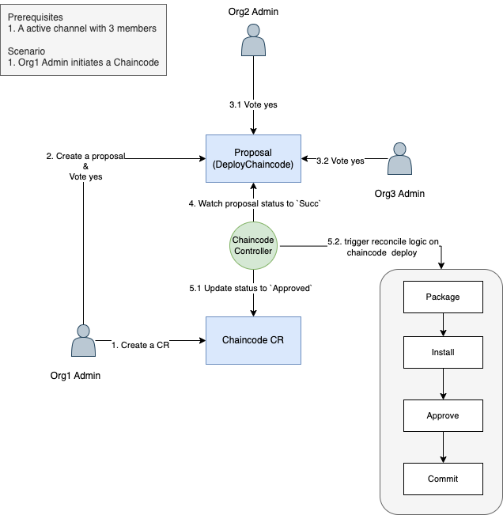

# **Chaincode 设计**

`Chaincode`为区块链中的概念，代表一个智能合约应用

## **RBAC**

`Chaincode` CR创建后:

1. 赋予所有channel 成员对此chaincode的`get\delete`权限
2. 通过webhook限制`delete`,仅允许删除状态为`Unapproved`的Chaincode


## **CRD定义**


1. `ChaincodeSpec`

```go
type ChaincodeSpec struct {
	License License `json:"license"`
	Channel string `json:"channel"` // 所属Channel
     ID string `json:"string"` // Chaincode ID
     Version string `json:"version"` //  当前版本
     EndorsePolicy `json:"endorsePolicy,omitempty"` // 合约审计策略
     ExternalBuilder string `json:"externalBuilder,omitempty"` // 使用的ExternalBuilder，默认为k8s
     Images map[string]ChaincodeImage `json:"images,omitempty"` // 存储不同版本使用的Chaincode镜像
}

type ChaincodeImage struct {
       Name string    `json:"name,omitempty"` // 镜像名称
       Digest string   `json:"digest,omitempty"` // 镜像的sha256
       PullSecret string `json:"pullSecret,omitempty"` // 镜像拉取所用secret
}
```


2. `ChaincodeStatus`

```go
type ChaincodePhase string
const (
   ChaincodePending ChaincodePhase = "ChaincodePending" // 创建时，默认为Pending
   ChaincodeApproved  ChaincodePhase  = "ChaincodeApproved" // proposal成功，修改为Approved
   ChaincodeUnapproved ChaincodePhase  = "ChaincodeUnapproved" // proposal失败，修改为Failed
)

// 标记controller reconcile不同阶段的状态
type ChaincodeConditionType string
const (
   ChaincodePackaged ChaincodeConditionType = "Packaged" // chaincode 打包成功
   ChaincodeInstalled ChaincodeConditionType = "Installed" // chaincode 代码安装成功
   ChaincodeApproved  ChaincodeConditionType  = "Approved" //  chaincode定义已获得批准
   ChaincodeCommitted ChaincodeConditionType  = "Committed" // chaincode定义已经提交到链上
   ChaincodeRunning ChaincodeConditionType  = "Running" // chaincode正在运行中(pod启动)
   ChaincodeError ChaincodeConditionType = "Error" // package/install/approve/commit过程中出现问题时
)

type ChaincodeCondition struct {
	// Type is the type of the condition.
	Type ChaincodeConditionType `json:"type"`
	// Status is the status of the condition.
	// Can be True, False, Unknown.
	Status metav1.ConditionStatus `json:"status"`
	// Last time the condition transitioned from one status to another.
	// +optional
	LastTransitionTime metav1.Time `json:"lastTransitionTime,omitempty"`
	// Unique, one-word, CamelCase reason for the condition's last transition.
	// +optional
	Reason string `json:"reason,omitempty"`
	// Human-readable message indicating details about last transition.
	// +optional
	Message string `json:"message,omitempty"`
}
// 记录chaincode的版本更新历史
type ChaincodeHistory struct {
       Version string // 版本
       Image ChaincodeImage // 使用的镜像
}

type ChaincodeStatus struct {
     // Chaincode历史
     History []ChaincodeHistory `json:"history"`
     // Chainocode的状态
     Phase   ChaincodePhase `json:"phase"`
     // Chaincode  reconcile不同阶段的状态
     Conditions []ChaincodeCondition `json:"conditions"`
     // 消息
     Message string `json:"message,omitempty"`
     // 原因
     Reason string `json:"reason,omitempty"`
}
```


3.  新增两种类型的Proposal

```go
// 部署合约提议
type DeployChaincodeProposal struct {
     Chaincode string `json:"chaincode"`
}

// 升级合约提议
type UpgradeChaincodeProposal struct {
     Chaincode string `json:"chaincode"`
     NewVersion string `json:"newVersion"`
     NewChaincodeImage ChaincodeImage `json:"newChaincodeImage"`
}
```

## **核心流程**

### 预先准备

1. `Peer`节点镜像需要使用:  `https://github.com/bestchains/fabric-builder-k8s/blob/main/Dockerfile`
2. 提前构建好chaincode镜像 `https://github.com/bestchains/fabric-builder-k8s/tree/main/samples/go-contract`


### 创建部署一个Chaincode 

创建流程如下:




#### 1.  通道的成员创建CR `Chaincode`

```
- Channel: 所属通道
- ID : chaincode id
- Version : chaincode版本
- EndorsePolicy : chaincode审计策略 
- ChaincodeImage： 当前版本所需的镜像
```

创建后，为channel的成员组织admin用户开通`get\delete`权限


#### 2. 创建一个 `DeployChaincode`提议(Policy仅允许为ALL)

- 为Channel成员开通提议权限

#### 3. 通道成员投票

- 任何一个成员如果投票 `no`,则提议失败
- 所有成员如果投票 `yes`,则提议成功

#### 4. controller处理投票结果

1. 如果 `propsoal fail`

- 更新chaincode状态为 `unapproved`

2. 如果 `proposal succ`

- 更新chaincode状态为 `approved`


#### 5. chaincode状态更新为 `approved`后的处理流程

1. package chaincode[参考](https://github.com/hyperledgendary/conga-nft-contract/releases/download/v0.1.1/conga-nft-contract-v0.1.1.tgz)

- if succ, append condition `ChaincodePackaged`
- if fail, append condition `ChaincodeError` with error message

2. install chaincode to all channel peers
[参考](https://github.com/bestchains/fabric-operator/blob/main/sample-network/scripts/run-e2e-test.sh#L92)

- if succ,append condition `ChaincodeInstalled`
- if fail, append condition `ChaincodeError` with error message

3. do `approve chaincode` for each member [参考](https://github.com/bestchains/fabric-operator/blob/main/sample-network/scripts/run-e2e-test.sh#L96)

- if succ,append condition `ChaincodeApproved`
- if fail, append condition `ChaincodeError` with error message

4. do `commit chaincode`  by any org in this channel[参考](https://github.com/bestchains/fabric-operator/blob/main/sample-network/scripts/run-e2e-test.sh#L107)

- if succ,append condition `ChaincodeCommitted `
- if fail, append condition `ChaincodeError ` with error message

5. check chaincode service status[参考](https://github.com/bestchains/fabric-operator/blob/main/sample-network/scripts/run-e2e-test.sh#L117)

- if succ,append condition `ChaincodeRunning`
- if fail, append condition `ChaincodeError` with error message

### 升级`Chaincode`

升级流程如下:


#### 1. 创建提议 `UpgradeChaincode`

#### 2. channel所有成员投票

- 任何一个成员如果投票 `no`,则提议失败
- 所有成员如果投票 `yes`,则提议成功

#### 3. 处理提议投票结果

1. 如果提议成功

更新Chaincode CR

- `spec.version` : set from `UpgradeChaincode`
- `spec.Images`: set from   `UpgradeChaincode`
- `status.history`: append from previous version and image

2. 如果提议失败

do nothing

#### 4. 提议成功后的合约升级流程

1. reconcile `Chaincode` upgrade

- package
- install
- approve
- commit
- check chaincode service status

### 删除 `Chaincode`

1. 仅允许`chaincode.status`为`unapproved`时，删除Chaincode CR
2. `Approved` Chaincode can't be deleted