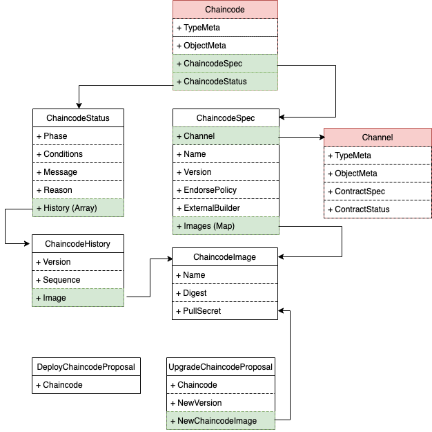

# **Chaincode 设计**

`Chaincode`为区块链中的概念，代表一个智能合约应用

## **权限设计**

| 用户类型 | 拥有 | 拥有(条件满足)  |  不拥有  |
| ------ | ---- | ------------- |  -----  |
| channel.members  |  create/get  |  - |  update/patch/delete |

详细解释:

1. 通道的所有成员组织都可以创建属于某通道的chaincode
2. `channel`的成员可以查看chaincode
3. 通道所有成员都不具备Chaincode的`update/patch/delete`权限.需要通过`proposal-vote`机制来完成

## **CRD定义**



1. `ChaincodeSpec`

```go
type ChaincodeSpec struct {
	License License `json:"license"`
	Channel string `json:"channel"`
        Name string `json:"string"`
        Version string `json:"version"`
        EndorsePolicy `json:"endorsePolicy,omitempty"`
        ExternalBuilder string `json:"externalBuilder,omitempty"`
        Images map[string]ChaincodeImage `json:"images,omitempty"`
}

type ChaincodeImage struct {
       Name string    `json:"name,omitempty"`
       Digest string   `json:"digest,omitempty"`
       PullSecret string `json:"pullSecret,omitempty"`
}
```


2. `ChaincodeStatus`

```go
type ChaincodePhase string
const (
   ChaincodePending ChaincodePhase = "ChaincodePending"
   ChaincodeApproved  ChaincodePhase  = "ChaincodeApproved"
   ChaincodeUnapproved ChaincodePhase  = "ChaincodeUnapproved"
)

type ChaincodeConditionType string
const (
   ChaincodePackaged ChaincodeConditionType = "Packaged" // chaincode package succ
   ChaincodeInstalled ChaincodeConditionType = "Installed" // chaincode install succ on peer
   ChaincodeApproved  ChaincodeConditionType  = "Approved" //  chaincode approved by  peer
   ChaincodeCommitted ChaincodeConditionType  = "Committed" // chaincode committed to blockchain
   ChaincodeRunning ChaincodeConditionType  = "Running"
   ChaincodeError ChaincodeConditionType = "Error" // error when install/approve/commit
)

type ChaincodeCondition struct {
	// Type is the type of the condition.
	Type ChaincodeConditionType `json:"type"`
	// Status is the status of the condition.
	// Can be True, False, Unknown.
	Status metav1.ConditionStatus `json:"status"`
	// Last time the condition transitioned from one status to another.
	// +optional
	LastTransitionTime metav1.Time `json:"lastTransitionTime,omitempty"`
	// Unique, one-word, CamelCase reason for the condition's last transition.
	// +optional
	Reason string `json:"reason,omitempty"`
	// Human-readable message indicating details about last transition.
	// +optional
	Message string `json:"message,omitempty"`
}

type ChaincodeHistory struct {
       Version string
       Sequence int
       Image ChaincodeImage
}

type ChaincodeStatus struct {
     History []ChaincodeHistory `json:"history"`
      Phase   ChaincodePhase `json:"phase"`
     Conditions []ChaincodeCondition `json:"conditions"`

      Message string `json:"message,omitempty"`

       Reason string `json:"reason,omitempty"`
}
```


3.  新增Proposal

```go
type DeployChaincodeProposal struct {
     Chaincode string `json:"chaincode"`
}

type UpgradeChaincodeProposal struct {
     Chaincode string `json:"chaincode"`
     Version string `json:"version"`
     NewChaincodeImage ChaincodeImage `json:"newChaincodeImage"`
}
```


## **CRD Reconcile**

### Prerequsities
1. fabric peer must use image built from `https://github.com/bestchains/fabric-builder-k8s/blob/main/Dockerfile`
2. build chaincode image,then get image digest like `https://github.com/bestchains/fabric-builder-k8s/tree/main/samples/go-contract`

### deploy a  new `Chaincode` 
#### 1.  create a CR `Chaincode`.must provide:
```
- Channel
- Name
- Version
- EndorsePolicy
- Chaincode image for this version
```

#### 2. create a proposal `DeployChaincode`(Only ALL is allowed at this kind of proposal)
- create votes to all channel `members`

#### 3. every channel member votes 
- if anyone vote `no`,this proposal fails
- if everyone vote `yes`,this proposal succ

#### 4. reconcile proposal result 
##### 4.1 reconcile `propsoal fail`
- mark chaincode's phase as `unapproved`

##### 4.2 reconcile `proposal succ`
- mark chaincode's phase as `approved`

##### 5. reconcile if `approved`
1. package chaincode 
like `https://github.com/hyperledgendary/conga-nft-contract/releases/download/v0.1.1/conga-nft-contract-v0.1.1.tgz` 

- if succ,append condition `ChaincodePackaged `
- if fail, append condition `ChaincodeError ` with error message

2. install chaincode to all channel peers
https://github.com/bestchains/fabric-operator/blob/main/sample-network/scripts/run-e2e-test.sh#L92

- if succ,append condition `ChaincodeInstalled `
- if fail, append condition `ChaincodeError ` with error message

3. do   `approve chaincode` for each member org
https://github.com/bestchains/fabric-operator/blob/main/sample-network/scripts/run-e2e-test.sh#L96

- if succ,append condition `ChaincodeApproved `
- if fail, append condition `ChaincodeError ` with error message

4. do `commit chaincode`  by any org in this channel
https://github.com/bestchains/fabric-operator/blob/main/sample-network/scripts/run-e2e-test.sh#L107

- if succ,append condition `ChaincodeCommitted `
- if fail, append condition `ChaincodeError ` with error message

5. check chaincode service status 
https://github.com/bestchains/fabric-operator/blob/main/sample-network/scripts/run-e2e-test.sh#L117

- if succ,append condition `ChaincodeRunning `
- if fail, append condition `ChaincodeError ` with error message

### upgrade a `Chaincode`
#### 1. create a proposal `UpgradeChaincode`

#### 2. member votes on `UpgradeChaincode`

#### 3. when `UpgradeChaincode` ends
##### 3.1 when succ
1. update CR `Chaincode`
- `spec.version` : set from `UpgradeChaincode`
- `spec. Images`: set from   `UpgradeChaincode`

##### 3.2 when fail
do nothing

#### 4. reconcile `Chaincode` update
1. redo - reconcile `Chaincode` create

- package
- install
- approve
- commit
- check chaincode service status
