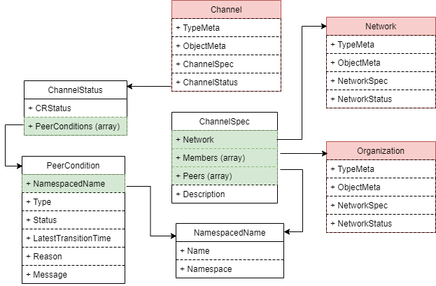

# **Channel 设计**

`Channel`为区块链中的概念，代表一条独立的链，拥有一套独立的账本和状态数据库

## **权限设计**

| 用户类型 | 拥有 | 拥有(条件满足)  |  不拥有  |
| ------ | ---- | ------------- |  -----  |
| ALL Users |  create  |  - | - |
| channel.members  |  get  |  update/patch |  delete |

1. 网络的所有成员组织都可以创建属于该网络的`channel`  
2. 仅`channel`的成员可以查看该通道
3. `channel`的成员可以更新 `channel.peers` (仅限自己拥有的节点)
4. 字段`channel.members`不允许直接更新，需要通过`proposal-vote`来完成
5. `channel`不允许删除，仅允许通过`proposal-vote`来标记为`deprecated`

## **CRD定义**



1. `ChannelSpec`

```
// ChannelSpec defines the desired state of Channel
type ChannelSpec struct {
	// License should be accepted by the user to be able to setup console
	// +operator-sdk:gen-csv:customresourcedefinitions.specDescriptors=true
	License License `json:"license"`

	// Network which this channel belongs to
	// +operator-sdk:gen-csv:customresourcedefinitions.specDescriptors=true
	Network string `json:"network"`

	// Members list all organization in this Channel
	// +operator-sdk:gen-csv:customresourcedefinitions.specDescriptors=true
	Members []Member `json:"members"`

	// Peers list all fabric peers joined at this channel
	Peers []NamespacedName `json:"peers,omitempty"`

	// Description for this Channel
	// +operator-sdk:gen-csv:customresourcedefinitions.specDescriptors=true
	Description string `json:"description,omitempty"`
}
```

解释:

- `Network`: Channel所属网络
- `Members`: Channel的成员组织
- `Description`: Channel的描述信息

2. `ChannelStatus`

```
type PeerCondition struct {
	NamespacedName `json:",inline"`
	// Type is the type of the condition.
	Type PeerConditionType `json:"type"`
	// Status is the status of the condition.
	// Can be True, False, Unknown.
	Status metav1.ConditionStatus `json:"status"`
	// Last time the condition transitioned from one status to another.
	// +optional
	LastTransitionTime metav1.Time `json:"lastTransitionTime,omitempty"`
	// Unique, one-word, CamelCase reason for the condition's last transition.
	// +optional
	Reason string `json:"reason,omitempty"`
	// Human-readable message indicating details about last transition.
	// +optional
	Message string `json:"message,omitempty"`
}

// ChannelStatus defines the observed state of Channel
type ChannelStatus struct {
	CRStatus       `json:",inline"`
	PeerConditions []PeerCondition `json:"peerConditions,omitempty"`
}
```


## **核心流程**

### 创建通道

接收到Channel创建请求后，将按照如下流程处理:

1. Webhook校验

校验内容包括:

	- 当前用户是否为发起者组织的管理员
	- `Members`是否均属于`Network`
	- `Peers`中节点是否均属于发起者组织

2. 初始化共识集群

> Note: 网络下的通道共用同一个共识集群(orderer cluster)

共识集群初始化流程如下:

```
1. 获取共识集群下所有orderer节点的连接信息、证书内容
2. 封装通道的genesis block
3. 调用orderer节点的admin api，将orderer节点加入此通道
```

3. 配置rbac权限

- 授予`channel.spec.members`下所有成员组织相应的`get/update/patch`权限

4. 为channel生成相应的`connection profile`，用于访问此通道 

5. 处理peers

如果通道创建过程中`channel.spec.peers`不为空，则需要将每个peer加入到通道中。(参考: 更新通道-peer节点加入)


### 更新通道

#### peer节点加入

> Note： 当 `channel.spec.peers` 中新增某个peer时触发

处理流程：

1. 获取peer节点的连接信息
2. 获取peer所处组织的admin用户的公私钥(from org-msp-cryto)，更新到channel的`connection profile`
3. 通过链`connector`发起节点加入
4. 获取处理结果，并更新到`channel.status.peerConditions`


#### peer节点退出

目前不需要做处理

#### 弃用(deprecated)通道

> Note: 通过增加一个label `bestchains.channel.deprecated: true`

通道的弃用(set label `bestchains.channel.deprecated：true`) 需要通过`proposal-vote`来实现，流程如下:

1. 创建一个proposal `deprecateChannel` 
2. channel controller监听`proposal`，当发现提议`deprecateChannel`成功后，设置label `bestchains.channel.deprecated: true`


### 删除通道

Channel创建后，不允许直接删除，仅跟随其所属的`Network`的删除而删除