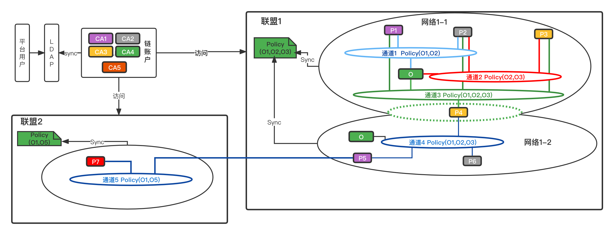

## BaaS概念定义、解释

## 平台概念
- `平台用户`: 区块链服务平台的用户，平台用户均在各自的`user namespaces`。在各自所属组织内可以细分为两类：
    - `Admin`: 所在组织的管理者,拥有`CA.Admin`,代表组织参与区块链网络，负责管理组织的联盟、网络、通道、节点等资源
    - `普通用户`: 拥有`CA.Client`,作为组织普通用户参与区块链网络
- `baas-system`:为`BAAS`服务的`system namespace`，`operator`以及一些系统管理相关资源在此命名空间.
- `Organization`: 区块链的组织，作为联盟成员参与区块链网络中
- `Federation`: 一组平台用户(组织/机构)共同组建的区块链联盟
    - `Initiator`: 联盟发起者
    - `Policy`: 联盟内部的决策机制，目前包含`Any`|`Marjority`两种
- `Network`: 联盟成员所组建的区块链网络: 
    - 网络成员依赖于`Federation`管理的成员列表
    - `Federation Initiator`提供的区块链排序服务`ordering service`
    - `Federation Member`提供的账本节点`Peers`
- `Channel`: 基于`Network`的成员列表信息和节点信息，创建的一条真正意义上的`链`
    - 链成员组织为`Federation`成员列表子集
    - 拥有独立的账本、节点、智能合约管理
- `Proposal-Vote`: 联盟内部的决策机制，用于联盟的组建/解散、成员新增、创建网路、创建channel、智能合约的安装部署等联盟或集体行为
    

## 区块链概念
- `CA`: 证书颁发机构
- `Orderer`: 区块链排序节点,拥有`CA-orderer`身份。基于`etcd/raft`共识协议，可构建`1-3-5`共识节点集群
- `Peer`: 区块链账本节点，拥有`CA-peer`身份。各`peer`节点独立维护账本、状态数据库、智能合约
- `Ledger`: 区块链账本，存储`链`的所有交易数据
- `智能合约`(chaincode/smartcontract):  区块链上的无状态应用。用于执行交易，获得交易执行结果(状态转移)
- `StateDB`: 状态数据库。区块链交易经排序节点排序出块后，区块存储到`Ledger`，交易逐条验证后，将`状态转移`信息同步到`StateDB`

