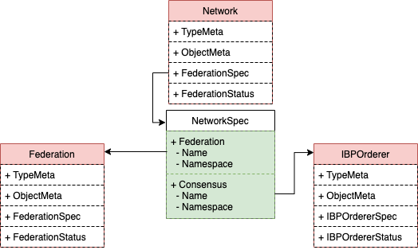

# **网络的设计**

`Network`是一个`Cluster`级别的资源，由联盟成员共同组建。其中:

- 联盟中任何成员都可以创建网络并提供排序服务(可新建或沿用之前的排序服务)
- 网络成员依赖`Federation`的定义(暂时不支持自定义)
- 网络的其他参与者可选择性的将基础节点加入到该网络中

## **权限设计**

| 用户类型 | 拥有 | 拥有(条件满足)  |  不拥有  |
| ------ | ---- | ------------- |  -----  |  
| Admin(network创建者)  |  create/get/list/watch  |  delete(状态为failed/dissolved) |  update/patch |
| Admin(network参与者)  |  get/list/watch  |  - |  update/patch |
| Client  |  get/list/watch  |  delete(状态为failed/dissolved) |  update/patch |

解释：

- `Federation`下的任何组织都可以创建网络`Network`
- 删除`Network`仅允许`Network.status == Dissolved`
- `Network`的更新需要通过`ProposalVote`进行，不允许`Admin/Client`直接进行

## Network CRD定义

1. `NetworkSpec`

```go
type NetworkSpec struct {
	// Federation
	Federation NamespacedName `json:"federation,omitempty"`

	// Consensus cluster(IBPOrderer)
	Consensus NamespacedName `json:"consensus,omitempty"`
    
}
```



解释

- `Federation`: 网络所属联盟

- `Consensus`: 网络排序组件，必须与`Network`为相同`Namespace`，即由`Network`创建者负责提供其拥有的`Consensus(IBPOrderer)`

2. `NetworkStatus`

```go
type ConditionType string
const (
    Activated ConditionType = "Activated" // Network activated
    Dissolved ConditionType = "Dissolved" // Network dissolved by `Proposal-Vote`
)
```

Network分为两个状态:

- **Activated**: 代表当前联盟的排序服务已经创建完成
- **Dissolved**: 代表当前联盟的`DissolveFederation proposal-vote`成功，联盟已经解散

## **Webhook设计**

1. `Mutating Webhook`

- 设置`Consensus.Namespace`为当前`Netowrk.Namespace`

2. `Validating Webhook`

- `ValidateCreate`
  - 验证Federation的状态
  - 验证Consensus(IBPOrderer)的状态

- `ValidateUpdate`
  - 不允许更新`Consensus`
  - 不允许更新`Federation`

- `ValidateDelete`:
  - skip

## **Contoller控制器设计**

### Predict

1. Predict.CreateFunc

- TODO

2. Predict.UpdateFunc

- TODO

3. Predict.DeleteFunc

- TODO

### Reconcile

1. 查看`Federation`状态，并更新`Network.Status`

2. 查看`Consensus(IBPOrderer)`状态，并更新`Network.Status`
