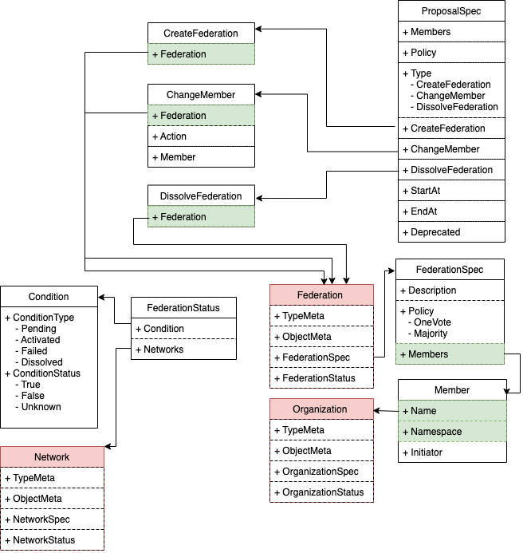
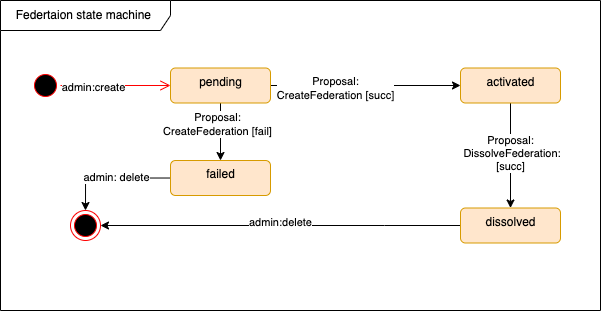

## **联盟的设计**
`Network`是一个`Cluster`级别的资源，由联盟成员共同组建


### **整体设计**
TODO...


### **权限设计**
| 用户类型 | 拥有 | 拥有(条件满足)  |  不拥有  |
| ------ | ---- | ------------- |  -----  |  
| Admin(联盟发起者)  |  create/get/list/watch  |  delete(状态为failed/dissolved) |  update/patch |


### Network CRD定义
1. `NetworkSpec`
```go
type NetworkSpec struct {
    Federation string `json:"federation,omitempty"`  // must be at status
    
}
```
解释：
- `Federation`: 网络所属联盟，对应`CRD Organization`
- `Description`: 



2. `NetworkStatus` 
```go
type ConditionType string
const (
    Pending ConditionType = "Pending"
    Activated ConditionType = "Activated"
    Failed ConditionType = "Failed"
    Dissolved ConditionType = "Dissolved"
)
type ConditionStatus string
const (
    ConditionTrue ConditionStatus = "True"
    ConditionFalse ConditionStatus = "False"
    ConditionUnknown ConditionStatus = "Unknown"
)

type NetworkStatus stuct {
    Type ConditionType  `json:"type,omitempty"`
    Status ConditionStatus `json:"status,omitempty"`

    Reason string  `json:"reason,omitemtpy"`
    Message string `json:"message,omitempty"`

    ObservedGeneration int64 `json:"observedGeneration,omitemtpy"`
    LastTransitionTime Time `json:"lastTransitionTime,omitempty"`
}

```


Federation分为四个状态:
- **Pending**: 代表当前联盟的`CreateFederation proposal-vote`还在进行中,仍处在组建当中
- **Activated**: 代表当前联盟的`CreateFederation proposal-vote`成功，联盟正式激活
- **Failed**: 代表当前联盟的`CreateFederation proposal-vote`失败,联盟组建失败
- **Dissolved**: 代表当前联盟的`DissolveFederation proposal-vote`成功，联盟已经解散


**状态转移图如下:**



### **Webhook设计**
1. `Mutating Webhook`: 
TODO
2. `Validating Webhook`
    - `ValidateCreate`: 
        - 验证当前`Members`列表中的组织`Organization`是否都存在
    - `ValidateUpdate`: skip
        - 验证新成员组织是否存在`Organization`
    - `ValidateDelete`:
        - 验证当前联盟状态是否为`Failed/Dissolved`

### **Contoller控制器设计**
#### **Federation创建**   
TODO: 无需额外操作

#### **Federation更新**    
三种(prposal相关)更新:   
    -  创建联盟: `CreateFederation`  
    -  更新成员:`ChangeFederationMember`     
    -  解散联盟: `DissolveFederation`    


> `CreateFederation`的处理流程为:
>  1. controller监听`proposal`(type `CreateFederation` related)
>  2. 针对`proposal`状态:
    - 如果proposal为`succ`,则更新`Fedeation`状态为`Activated`
    - 如果proposal为`fail`,则更新`Federation`状态为`Failed`


> `ChangeFederationMember`的处理流程:
>  1. controller监听`proposal succ`(type `ChangeFederationMember` related)
>  2. 在`members`列表中，删除/新增一个成员组织


> `DissolveFederation`的处理流程为：
> 1. controller监听`proposal succ`(type `DissolveFederation` related)
> 2. 更新`Fedeation`状态为`Dissolved`


#### **Federation删除**
<mark> **TODO:** 考虑跟其他CRD资源的关联，如proposal|vote|network|channel......</mark>