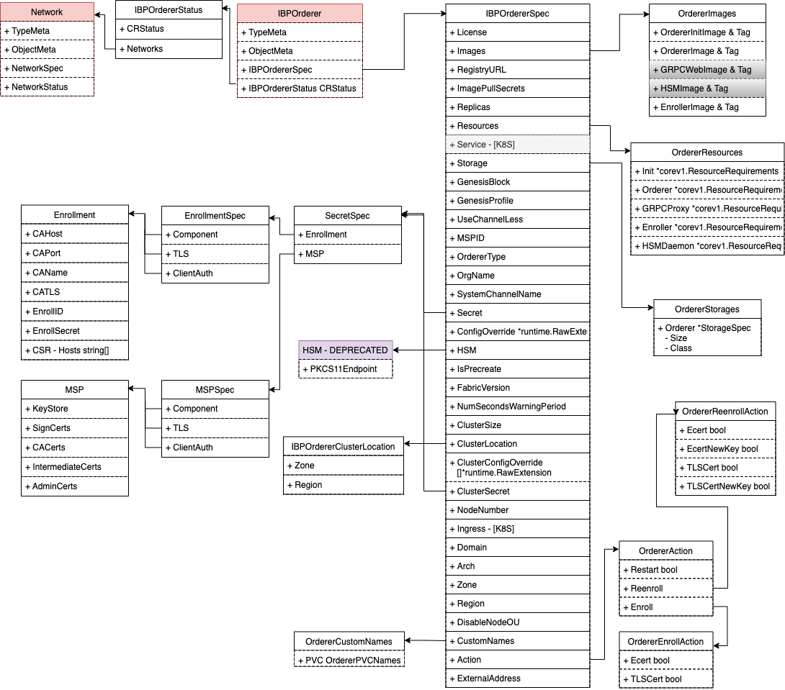

# **Orderer共识组件设计(IAM适配)**

`Orderer(Consensus)`是一个`Namespace`级别的资源。

## **权限设计**

| 用户类型 | 拥有 | 拥有(条件满足)  |  不拥有  |
| ------ | ---- | ------------- |  -----  |  
| Admin(orderer创建者)  |  create/get/list/watch/update/patch  |  delete(当无依赖的Network时) | - |
| Client  |  get/list/watch  | - |  update/patch |

解释：

1. 组织的Admin可以在自己的命名空间创建`IBPOrderer(cluster)`

2. `IBPOrderer`仅允许在没有依赖的`Networks`时删除


## Orderer CRD定义

1. `OrdererSpec`

TODO:

2. `OrdererStatus`

```go
type IBPOrdererStatus struct {
	CRStatus `json:",inline"`

	// Networks which utilize this IBPOrderer cluster
	Networks []NamespacedName `json:"networks,omitempty"`
}
```




## **Webhook设计和任务**

1. `Mutating Webhook`

TODO

2. `Validating Webhook`
    - `ValidateCreate`: 
        <!-- - 验证当前`Members`列表中的组织`Organization`是否都存在 -->
    - `ValidateUpdate`: skip
        <!-- - 验证新成员组织是否存在`Organization` -->
    - `ValidateDelete`:
        - 验证当前是否还有`Networks`引用此排序服务

## **Controller设计和任务**

1. Watch `CRD Network`

- 当`Create Network`时，检测并更新 `Consensus(IBPOrderer.Status.Networks)`
- 当`Delete Network`时，检测并更新`Consensus(IBPOrderer.Status.Networks)`

2. 与IAM适配，获得`EnrollIDs`

3. `GenesisBlock`生成过程需与`IAM`和 `Organization`集成

