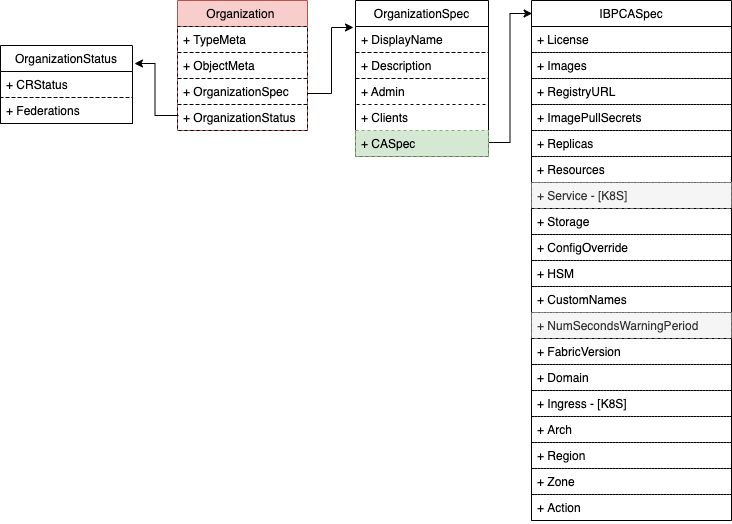

## **Organization 设计**

`Organization`用于作为成员组织参与联盟、网络，为`Cluster scope`资源。  
> <mark>**组织与CA为一一对应关系,即`1 Organization = 1 CA`** </mark>  

### **权限设计**

| 用户类型 | 拥有 | 拥有(条件满足)  |  不拥有  |
| ------ | ---- | ------------- |  -----  |  
| All User |  create/get/list  |  - |  all |
| Admin(in org)  |  create/get/list/update/patch/delete  |  - |  - |
| Client(in org) | create/get/list/watch | - | delete/update/patch |

### **CRD定义**

1. `OrganizationSpec`

```go
type OrganizationSpec struct {
	// License should be accepted by the user to be able to setup console
	// +operator-sdk:gen-csv:customresourcedefinitions.specDescriptors=true
	License License `json:"license"`

	// DisplayName for this organization
	// +operator-sdk:gen-csv:customresourcedefinitions.specDescriptors=true
	DisplayName string `json:"displayName,omitempty"`

	// Description
	// +operator-sdk:gen-csv:customresourcedefinitions.specDescriptors=true
	Description string `json:"description,omitempty"`

	// Admin is the User/ServiceAccount with `Admin` role both in kubernetes and in CA
	// +operator-sdk:gen-csv:customresourcedefinitions.specDescriptors=true
	Admin string `json:"admin"`

	// Clients are the Users/ServiceAccounts with `Client` role both in kubernetes and in CA
	Clients []string `json:"clients,omitempty"`

	// CASpec is the configurations of organization's related Certificate Authority
	// +operator-sdk:gen-csv:customresourcedefinitions.specDescriptors=true
	CASpec IBPCASpec `json:"caSpec,omitempty"`
}


```

`OrganizationSpec`包含以下字段:

- `DisplayName`: 组织的展示名称
- `Descriptionn`: 组织描述信息
- `Admin`: 组织的Admin用户
- `Clients`: 组织的client用户列表
- `CASpec` : 组织拥有的CA服务配置

2. `OrganizationStatus`

```go
type OrganizationStatus struct {
	// CRStatus is the custome resource status
	// +operator-sdk:gen-csv:customresourcedefinitions.specDescriptors=true
	CRStatus `json:",inline"`

	// Federations which this organization has been added
	// +operator-sdk:gen-csv:customresourcedefinitions.specDescriptors=true
	Federations []NamespacedName `json:"federations,omitempty"` 
}

type CRStatus struct {
	// Type is true or false based on if status is valid
	// +operator-sdk:gen-csv:customresourcedefinitions.statusDescriptors=true
	Type IBPCRStatusType `json:"type,omitempty"`

	// Status is defined based on the current status of the component
	// +operator-sdk:gen-csv:customresourcedefinitions.statusDescriptors=true
	Status IBPCRStatus `json:"status,omitempty"`

	// Reason provides a reason for an error
	// +operator-sdk:gen-csv:customresourcedefinitions.statusDescriptors=true
	Reason string `json:"reason,omitempty"`

	// Message provides a message for the status to be shown to customer
	// +operator-sdk:gen-csv:customresourcedefinitions.statusDescriptors=true
	Message string `json:"message,omitempty"`

	// LastHeartbeatTime is when the controller reconciled this component
	// +operator-sdk:gen-csv:customresourcedefinitions.statusDescriptors=true
	LastHeartbeatTime string `json:"lastHeartbeatTime,omitempty"`

	// Version is the product (IBP) version of the component
	// +operator-sdk:gen-csv:customresourcedefinitions.statusDescriptors=true
	Version string `json:"version,omitempty"`

	// ErrorCode is the code of classification of errors
	// +operator-sdk:gen-csv:customresourcedefinitions.statusDescriptors=true
	ErrorCode int `json:"errorcode,omitempty"`

	// Versions is the operand version of the component
	// +operator-sdk:gen-csv:customresourcedefinitions.statusDescriptors=true
	Versions CRStatusVersion `json:"versions,omitempty"`
}

type NamespacedName struct {
	Name      string `json:"name,omitempty"`
	Namespace string `json:"namespace,omitempty"`
}
```

其中:

- `CRStatus`: `Organization`的详细状态信息
- `Federations`: 记录当前组织所在的联盟列表




### **Webhook设计**

#### `Mutating Webhook` （TODO）

Default:

- DisplayName为空时，默认设置为`Organizatin Name`

#### `Validating Webhook`

1. Common Validate

- 验证`OrgName` | `DisplayName` | `Admin` | `CAReference`是否满足条件

2. Logic Validate

- `ValidateCreate`

 a. 校验参数是否服务
 c. 校验`Admin`

- `ValidateUpdate`
  a. 通用校验
- `ValidateDelete`
  a. 通用校验

### **Contoller控制器设计**

#### **Organization创建**

处理流程:

1. 创建namespace {org_name}
2. 基于`CASpec`创建组织CA
3. 配置`RBAC`:

  - 创建`{orgname}-blockchain:admin-clusterrole` 和 `{orgname}-blockchain:client-clusterrole`， 用于定义该组织下admin用户和client用户在cluster scope资源上的权限
  - 创建`{orgname}-blockchain:admin-clusterrolebinding`, 将上述的`admin-clusterrole`赋予 admin用户
  - 创建`{orgname}-blockchain:client-clusterrolebinding`，将上述的`client-clusterrole`赋予给组织下所有的`clients`用户
  - 创建`{orgname-blockchain:admin-role}`和 `{orgname-blockchain:client-role}`
  - 赋予`admin`用户上述`admin-role`,赋予所有的`clients`上述`client-role`权限 

4. 配置用户的注解\label

  - 为admin用户新增`BlockchainAnnotation`，内含`admin id`
  - 为admin用户增加label `bestchains.organization.{org_name}:admin`
  - 为所有clients用户新增`BlockchainAnnotation`,内含`client id`
  - 为所有clients用户增加label `bestchains.organization.{org_name}:client`


#### **Organization更新**  

- 场景1: 变换`Admin`用户

1. 更新rbac
  
  - 编辑`admin-clusterolebinding`，替换subject为新admin用户
  - 编辑`admin-rolebinding`，替换subject为新admin


2. 更新用户注解\label

  - 删除原`admin`用户的相关组织注解
  - 将原`admin`用户的组织注解添加到新`admin`用户上
  - 将注解内部的`admin id`更新为新用户

#### **Organization删除**

处理流程:

1. 删除所有组织为owner的资源
2. 删除该组织管理的namespace
3. 删除组织下所有用户的相关注解和label

### 相关讨论

1. 统一组织下的RBAC https://github.com/bestchains/fabric-operator/issues/21
2. 支持配置组织`clients`和`admin`转移 https://github.com/bestchains/fabric-operator/issues/20

