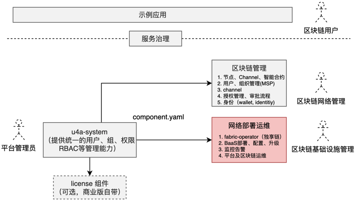
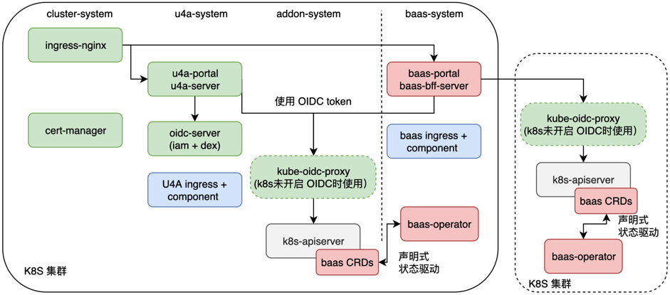

## BaaS v0.1 设计

### 1. 产品需求
BaaS v0.1 计划完成以下功能：
1、Fabric Operator 集成
链的部署通过 fabirc-operator 来实现

2、联盟管理
支持组织的管理

3、创建网络、网络管理
支持典型 network 的创建及管理

4、用户管理 - 使用共享组件
通过 u4a-system 的集成，来实现对 account、authentication、authorization、audit 的支持
注意：只有通过 K8S 资源操作的，才能实现 authorization 及 audit，所以要么通过 CRD 来进行抽象，一方面可以构建统一的抽象层，一方面可以实现基于资源的鉴权和审计

5、产品命名 

### 2. 总体设计
总体上规划（初步、按目前的理解），BaaS 需要开发以下组件：
  

#### 区块链的网络部署与运维
目前仅支持 Fabirc，设计上可以i考虑对多种链技术的兼容

1. 区块链网络部署与管理 - baas-ops
* 联盟的创建与管理（邀请成员，新建网络）
* 区块链网络的部署、配置、升级
* 区块链网络的运维（日志、事件、监控、告警等）

2. 区块链管理
* 网络概览
* 节点 - peer、ordering
* 通道 - channel
* 组织 - org
* 合约管理 - smart contact

### 3. 功能设计
#### 3.1 联盟的概念
是“租户”的意思？

* 主要属性

包括“联盟名称”、创建者/APPID、成员个数、网络个数、创建时间、加入时间

成员限制（实名认证）

联盟描述（选填）

* 可用操作
邀请成员、新建网络等（待补充其他操作）

* 其他
1. 需要提供获取用户昵称、APPID（账号APPID） 的位置，以便查看并对用户提供的该信息发送邀请

#### 3.2 创建网络
分为快速配置，自定义配置两类向导配置方式

##### 快速配置
1. 快速配置
需要提供
* 所属联盟
* 版本选择，提供典型的套餐，比如标准版、企业版、金融版，分别对应不同的节点配置（CPU、内存、存储），组织个数，节点个数（v0.1 先提供标准版即可）
* 地域选择（类似我们的 K8S 集群，可以通过 u4a 接入的集群来选择）
* 组织名称
* 高级选项（TBD）
* 计费模式，目前默认使用按秒计费方式，而不是按包月/包年模式，后续集成计费组件

##### 自定义配置
区别于快速配置的设计：
* 允许对组织、节点、CA分别进行额外的高级配置
* 选择状态数据库类型

#### 3.2 网络概览
* 节点情况
* 通道情况
* 组织数量
* 网络状态
* 可选操作：管理、配置、升级

#### 3.2 网络管理
* 网络概览（快速上链、关键指标、网络基础信息、网络配置信息）
* 通道管理
* 合约管理
* 组织与节点
* 区块链浏览器（TODO）
* 高级配置

### 4. 实现细节

#### 4.1 同外部系统关系
baas 的部署会以组件的方式注册到统一管理控制台上，其关系如下图所示：
  

1. baas 的开发主要分为两部分，baas-portal 和 baas-bff-server 由前端负责，baas CRDs 和 baas-operator 由后端负责。

2. baas-portal 基于微前端框架进行微应用开发及嵌入到统一控制台。按照 CRD 的模型设计，尽量使用统一的前端组件规范及低代码开发模式，避免在前端页面上花费过多的时间（当然，依赖目前的低代码模式能够做到什么程度，大家共同讨论是否合适）

3. baas-bff-server 由前端按照产品设计，通过 graphql 对后端基于 CRD 的 restful API 进行聚合，获取设计中所需的数据，根据 CRD 设计及产品设计的匹配程度，可能需要前端对业务有一定理解

4. baas CRDs 为区块链核心业务的抽象，作为业务资源存储在 K8S 的持久化存储 etcd 中

5. baas-operator 是区块链的运维工具，包括区块链的部署、配置、升级等，基于模型、状态驱动来保证系统按照 CRD 的规定处于期望的状态

#### 4.2 用户、租户设计

目前的主要设计包括：
* 用户的统一
* 租户的设计（类似联盟的概念？）
* 链网络的设计 - CRD
* 通道 Channel 的设计 - CRD
* 重用已有的 CA、peer、order CRD 资源定义

1. 将平台用户同区块链的新用户进行统一

CA 中关于用户的集成参考： https://hyperledger-fabric-ca.readthedocs.io/en/latest/users-guide.html

通过 u4a 提供的用户来提供给区块链的相关资源

数据持久化
```
Unless the Fabric CA server is configured to use LDAP, it must be configured with at least one pre-registered bootstrap identity to enable you to register and enroll other identities.

If you care about running the Fabric CA server in a cluster, you must configure either PostgreSQL or MySQL. Fabric CA supports the following database versions in a cluster setup:

* PostgreSQL: 9.5.5 or later
* MySQL: 5.7 or later
```
默认registry 是配置文件，数据库为 sqlite3

LDAP 集成
```
The Fabric CA server can be configured to read from an LDAP server.

In particular, the Fabric CA server may connect to an LDAP server to do the following:
* authenticate an identity prior to enrollment
* retrieve an identity’s attribute values which are used for authorization.
```

详细参见 [CA 设计](./ca-design.md)

2. 联盟/租户设计

详细参见 [联盟设计](./federation-design.md)

3. 链网络的设计

详细参见 [联盟设计](./network-design.md)

4. 通道的设计

详细参见 [联盟设计](./channel-design.md)

#### 4.3 注意事项
1. 注意 fabirc-operator 操作的资源同区块链网络 API 上操作的资源界定，明确好各自的职责
* 目前的 CRD 主要还是对区块链网络的部署、配置、升级等基础设施层的管理，不涉及到业务层的资源
* 对于智能合约等区块链网络内的业务操作，还是调用链上所提供的 API

2. IBPConsole 这个 CRD 目前看起来无法完全重用，需要分析一下哪些可以服用的，可能 deployer 还有些利用价值
