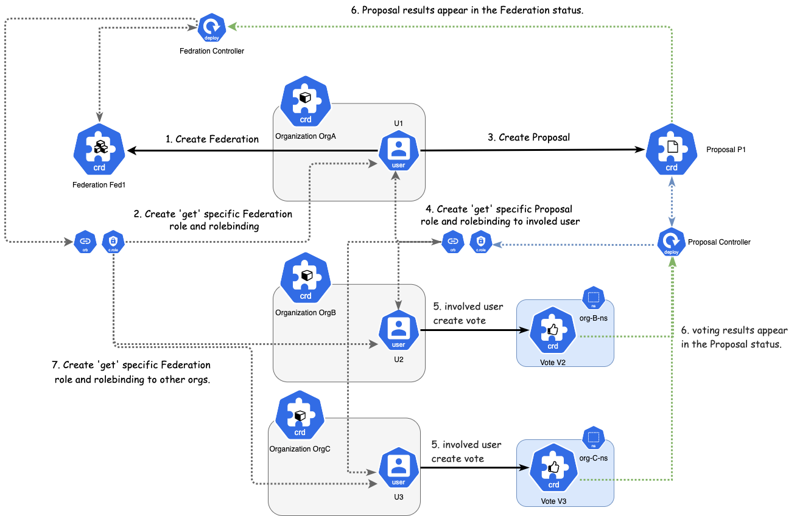
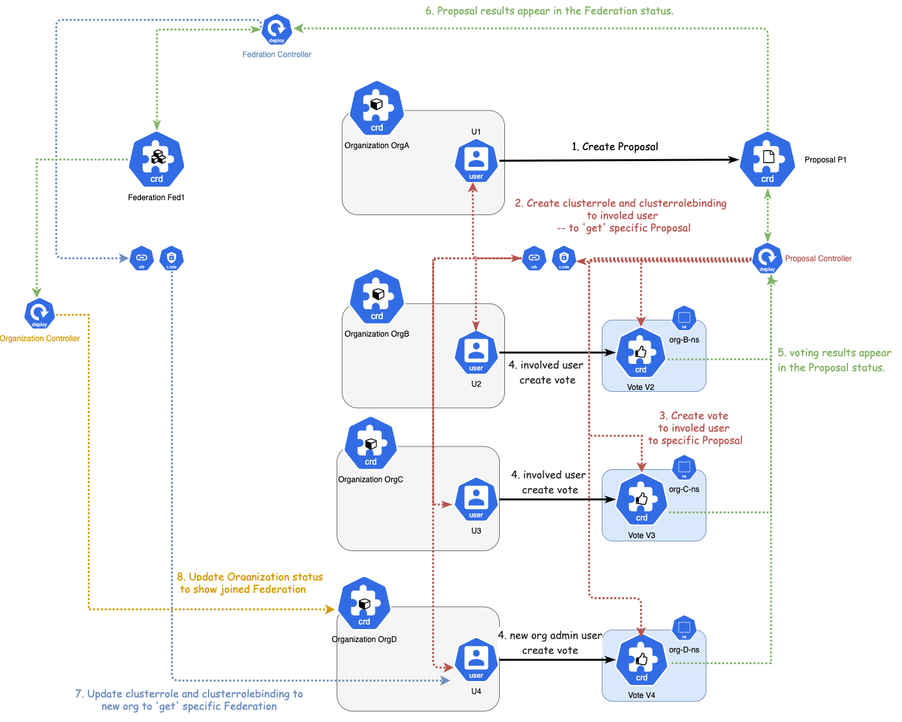
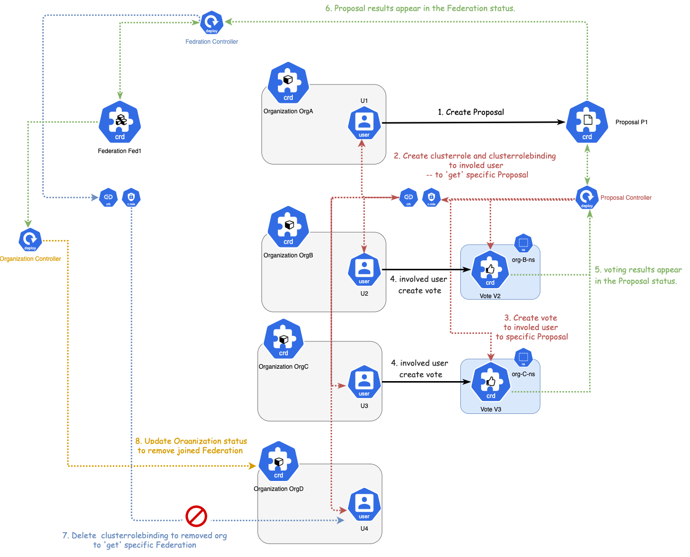
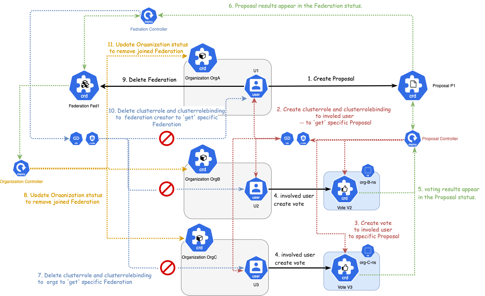

# Proposal-Vote机制设计

## 整体设计

涉及到5个CRD:

- Organization：组织
- User：用户
- Proposal：提案
- Vote：投票
- Federation：联盟

### CRD 设计

#### Proposal CRD

#### Vote CRD

## 具体使用场景

### 1. 创建联盟

### 2. 添加联盟成员

### 3. 驱逐 / 去除 某个联盟成员

### 4. 解散联盟

### 5. 部署 CodeChain

TODO
