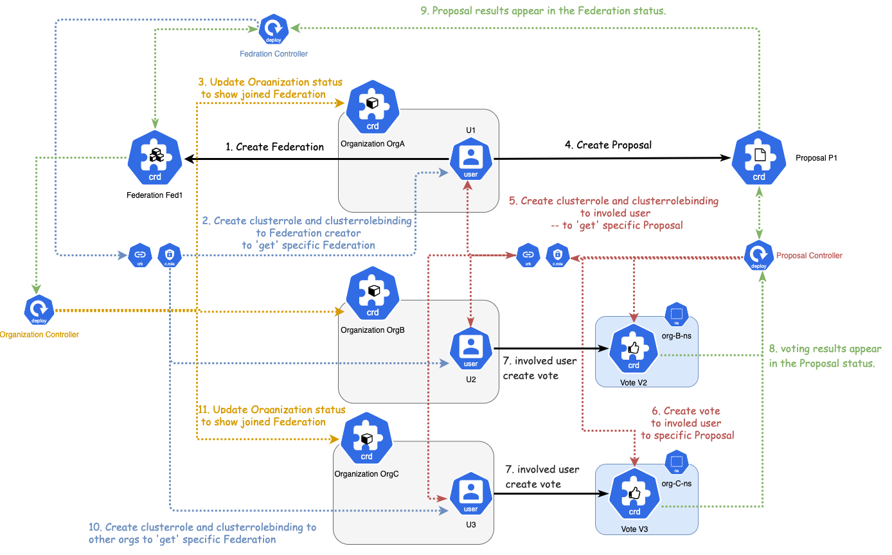

# Proposal-Vote 机制设计

## 整体设计

涉及到 5 个 CRD:

- [Organization：组织](organization-design.md)
- User：用户
- [Proposal：提案](#proposal-crd)
- [Vote：投票](#vote-crd)
- [Federation：联盟](federation-design.md)

### CRD 设计

#### Proposal CRD

`Proposal` 指的是针对联盟中要决策的事件的提案，比如要创建一个联盟，要添加一个成员，要驱逐/删除一个成员，要解散一个联盟，或者要部署一个 chaincode 等等。
这些事件都需要联盟中的 Organization 表决或投票，因此需要一个资源来表示这些提案并展示 Organization 表决或投票的结果。

**Cluster** 资源。

#### **权限设计**

| 用户类型 | 拥有                  | 拥有(条件满足) | 不拥有              |
| -------- | --------------------- | -------------- | ------------------- |
| Admin    | create/get/list/watch | -              | update/patch/delete |
| Client   | -                     | -              | -                   |

> 解释
>
> 1. 任何组织内的 `Admin` 用户都可以 `create` 一个提议。按照不同的提议类型，通过直接定义或者依赖的 CRD 处获取:
>    - 提议范围，即允许投票的组织
>    - 提议策略，即提示成功与否如何判断(Policy: OneVote | Majority)
>      举例: 如果为 `CreateFederation`，则需要从 `Federtaion CR` 中获取对应的 `成员列表` 和 `Policy`
> 2. `proposal` 的更新全部由 `controller` 基于 `vote` 的状态来进行，不允许用户主动更新

#### Vote CRD

`Vote` 指的是某个 Organization 针对某个提案 `Proposal` 表决或投票的结果，是否同意，如果不同意，还可以增加不同意的理由等。

**Namespeced** 资源，限定只在 Organization 自己的 namespace 中。

#### **权限设计**

| 用户类型 | 拥有                  | 拥有(条件满足) | 不拥有       |
| -------- | --------------------- | -------------- | ------------ |
| Admin    | create/get/list/watch | -              | update/patch |
| Client   | -                     | -              | all          |

## 具体使用场景

### 1. 创建联盟

1. 创建 Federation 资源：
   1. Organization OrgA 的 Admin 用户 U1 创建一个 Federation 资源 Fed1。
   2. Federation Webhook 会验证 Fed1 的 Initiator 字段为 OrgA，否则不予创建。
2. Federation Controller 监听到 Federation 资源的创建，自动给 Fed1 的 Initiator 字段对应的 Organization 的 Admin 用户创建针对 Fed1 的 get/list/watch/delete 权限。
3. 创建 Proposal 资源：
   1. Organization OrgA 的 Admin 用户 U1 创建一个类型为 CreateFederation 的 Proposal 资源 P1。
   2. P1 中会声明要和哪些 Organization 一起创建一个 Federation。
4. Proposal Controller 会监听到 Proposal 资源的创建，自动给该 Proposal 涉及到的 Organization 的 Admin 用户赋予针对 P1 的 get/list/watch 权限。
5. 创建 Vote 资源：
   1. 当 P1 涉及到的 Organization 的 Admin 用户可以发现有该 Proposal 时，可以各自在自己 Organization 的 namespace 中创建 Vote 资源。
   2. Vote 中会写明针对的 Federation Name 和 Proposal Name。
   3. Vote 中会写明是否同意该 Proposal，如果不同意，可以添加可选的反对理由。
   4. Vote 一旦创建则不可更改。
6. Proposal Controller 会监听所有 namespace 中 Vote 的创建，会将结果 patch 到对应的 Proposal 的状态中。
   Federation Controller 会监听 Proposal 的状态变化，当检测到 CreateFederation 类型的 Proposal 投票结果符合其规则时，更新该 Federation。
7. Federation Controller 根据 Federation 的 Spec 中 Organizaion，给予各个 Admin 用户 get/list/watch 这个 Federation 的权限。

### 2. 添加联盟成员

### 3. 驱逐 / 去除 某个联盟成员

### 4. 解散联盟

### 5. 部署 CodeChain

TODO
