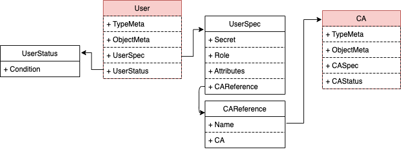

## **User 设计**

`User`用于作为平台用户与CA用户的纽带。平台用户新增/删除的过程，同步到`CR User`的`Create`/`Delete`。

### **权限设计**

| 用户类型 | 拥有 | 拥有(条件满足)  |  不拥有  |
| ------ | ---- | ------------- |  -----  |  
| Admin(in org)  |  get/list/watch/create/update/patch  |  - | - |
| Client(in org) | get/watch | - | craete/delete/update |

### **CRD定义**

1. `UserSpec`

```go
type UserSpec struct {
  // License should be accepted by the user to be able to setup console
  // +operator-sdk:gen-csv:customresourcedefinitions.specDescriptors=true
  License License `json:"license"`
  Secret string `json:"secret,omitemtpy"`
  Role string `json:"role,omitemtpy"`
  Atttibutes []Attribute `json:"attributes,omitempty"`
  // CARef which manage credentials for this organization
  CAReference `json:"caReference,omitempty"`
}


type CAReference struct {
  Name string
  CA string
}
```

`UserSpec`包含以下字段:

- `Secret`: CA认证密码。为空时将随机生成
- `Role`： 角色，支持Admin\Client两种
- `Attibutes`: (Optional) 额外的用户属性
- ` CAReference `: 组织所属的CA机构
  - `Name`: CA机构名称
  - `CA`: 具体使用哪个CA服务（ca/tlsca）



2. `UserStatus`

```go
type OrganizationStatus struct {
  // TODO: ...
  Condition metav1.Condition `json:"condition,omitempty"`  
}
```


### **Webhook设计**

#### `Mutating Webhook` （TODO）

#### `Validating Webhook` (TODO)

### **Contoller控制器设计**

#### **User创建**

处理流程:

1. `UserSpec.Secret`不存储在则随机生成

2. 向CA注册该用户 （ca register）
 
3. 向CA发起Enroll操作 (ca enroll)
**参考: Organization-Enroll**
- enroll获得的crypto信息存储到`k8s secret {username}-crypto-secret`


#### **User删除**

1. 向CA发起revoke操作

